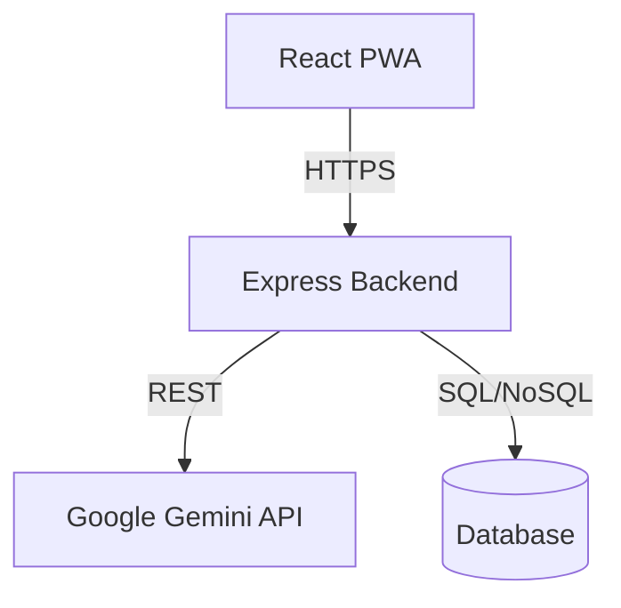

# Phase 1: Product & Compliance Spec

## Product Vision
"Klar" ist eine wertebasierte, hochsichere Dating-App für die DACH-Region. Im Gegensatz zu oberflächlichen Swiping-Apps fokussiert sich Klar auf tiefe Kompatibilität (AI-Matching), Transparenz und strikten Datenschutz (Privacy-by-Design). Zielgruppe sind sicherheitsbewusste Millennials und Gen-Z, die echtes Commitment suchen.

## User Personas & Jobs-to-be-Done
1. **Persona:** "Security-First Sarah" (28, München) - Will keine Fake-Profile und fürchtet Datenmissbrauch.
   - *JTBD:* Verifiziere mein Profil und matche mich nur mit echten Personen, deren Werte mit meinen übereinstimmen.
2. **Persona:** "Intentional Ian" (32, Berlin) - Ist genervt von Ghosting und endlosen Chats.
   - *JTBD:* Hilf mir mit KI-Coaching, Gespräche am Laufen zu halten und sinnvolle Dates zu planen.

## Feature-Priorisierung (MoSCoW)
**Must Have:** Smart Verbindung Algorithm, Secure Chat, Privacy/Consent Management, Delete Account, Legal Notices.
**Should Have:** AI Icebreakers, Report/Block User, Verified Badges.
**Could Have:** Date Planner, Resume Generator.
**Won't Have:** Public Search, Ads.

## Legal & Risk Register
- **DSGVO Art. 13/14:** Transparente Datenschutzerklärung.
- **DSGVO Art. 17:** Recht auf Löschung ("Delete Account" direkt im Profil).
- **ePrivacy:** Consent-Banner für optionale Cookies/Tracking.
- **Content Moderation:** In-App Reporting System (NetzDG-konform).
- **Jugendschutz:** 18+ Bestätigung beim Onboarding.

## Data Flow & Privacy Impact Assessment
- Daten minimiert erfasst (nur Vorname, Alter, Bio).
- KI-Coaching-Daten werden pseudonymisiert an das LLM gesendet.
- Keine Weitergabe von Daten an Third-Party Ad-Networks.

## Non-Functional Requirements
- **Performance:** Ladezeit < 2s (Mobile-First PWA).
- **Accessibility:** WCAG 2.2 AA (hoher Kontrast, Screenreader-ready).
- **Security:** In-Transit (TLS) und At-Rest Encryption, Rate-Limiting.

---

# Phase 2: Architecture & Tech Spec

## Empfohlener Stack
- **Frontend:** React 19 + Vite + TailwindCSS + Motion (schnell, PWA-ready).
- **Backend/Middleware:** Express (Node.js) mit Rate-Limiting.
- **Database:** Firebase / Cloud SQL (im Prototyp LocalStorage/Memory für Preview).
- **AI Integration:** Google Gemini SDK für Icebreakers, Verbindungs-Analyse, Coaching.
- **Auth:** Firebase Auth / JWT (Mocked for current version).

## High-Level Architecture Diagram

## Sicherheitsarchitektur
- **Auth:** JWT-based, Session Timeouts.
- **Rate-Limiting:** `express-rate-limit` (bereits im Stack) für API Endpoints.
- **Abuse-Prevention:** Report-User Workflow, automatische Flagging von toxischen Nachrichten (zukünftig).

---

# Phase 3: UI/UX System

## Design-Tokens & Component Library
- **Colors:** "Klar" Theme – helle, warme Töne (`stone-100` bis `stone-900`), Brand Color `brand` (warmes Dunkelbraun/Gold).
- **Typography:** Klare Sans-Serif, gut lesbar.
- **Components:** Runde Ecken (2xl, 3xl für Cards), soft Shadows (`shadow-sm`). Alle interaktiven Elemente mit Haptic Feedback und skalierenden Hover-States.

## Key Screens
1. **Dashboard:** Fokus auf wenige, hochqualitative Matches.
2. **Chat:** End-to-End verschlüsselt anmutend, mit KI-Coach Button.
3. **Profile & Settings:** Deep-Dive in Privacy Settings, Account Deletion.

## Accessibility
- Aria-Labels an allen Icon-Buttons.
- Kontrastverhältnis min. 4.5:1.

---

# Phase 4: Implementation Roadmap

## Aktueller Status
- Kern-Flows (Onboarding, Dashboard, Chat, Profile) sind implementiert.
- KI-Features (Icebreaker, Coach, Resume) sind live.
- Legal Notification System (Modal) ist live.

## Nächste Schritte (Sprint Backlog)
1. **Legal & Compliance (Epic):**
   - Consent/Cookie Banner implementieren.
   - Account Settings (AGB, Privacy, Delete Account) im Profil hinzufügen.
2. **Safety & Moderation (Epic):**
   - In-App Reporting (Nutzer melden) im Chat implementieren.
   - Profil-Verifizierung-Badge (UI) hinzufügen.

## Test-Strategie
- **Unit/Integration:** Fokus auf Verbindungs-Algorithmus und Consent-Management.
- **Legal Compliance:** Manueller Review der DSGVO-Löschfunktion.
